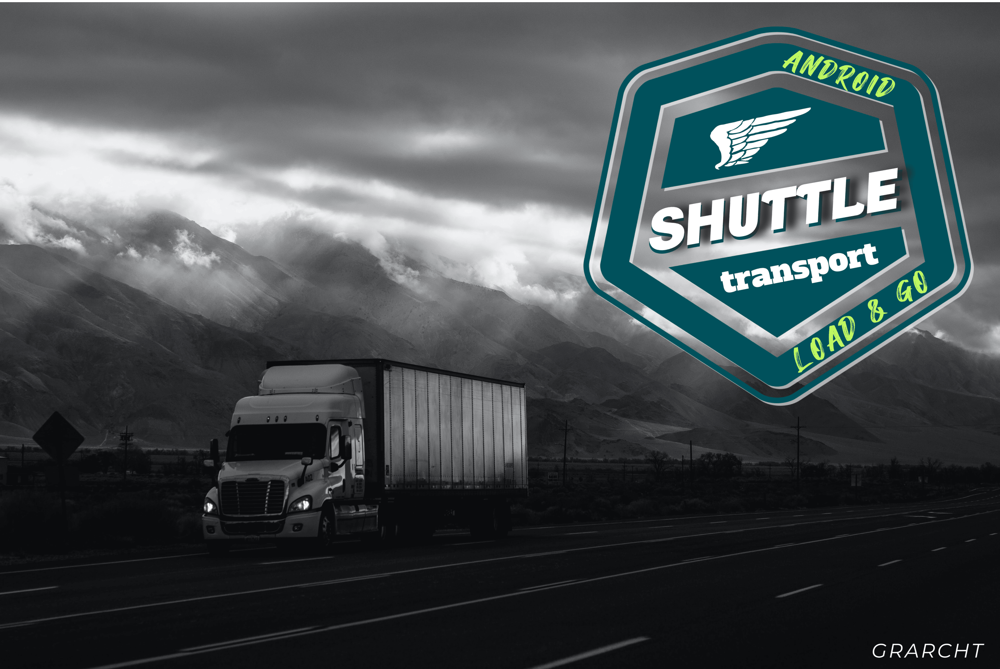

# Shuttle
[](https://github.com/grarcht/Shuttle/blob/main/LICENSE.md)   

Shuttle provides a modern, guarded way to pass large Serializable objects with Intent objects or saving them in Bundle objects to avoid app crashes.

Often, businesses experience the adverse side effects of risks introduced in daily software engineering.   These adverse side effects include time and money spent on app crash investigation, app crash fixes, quality assurance testing, releasing hotfixes, and extra governance through code reviews.

Shuttle reduces the high-level of governance needed to catch Transaction Too Large Exception inducing code by:
1. storing the Serializable and passes an identifier for the Serializable
2. using a small-sized Bundle for binder transactions
3. avoiding app crashes from Transaction Too Large Exceptions
4. enabling retrieval of the stored Serializable at the destination.

Why keep spending more time and money on governance through code reviews?  Why not embrace the problem by providing a solution for it?

When envisioning, designing, and creating the architecture, quality attributes and best practices were in mind. These attributes include usability, readability, recognizability, reusability, maintainability, and more.


## Background
The Shuttle framework takes its name from cargo transportation in the freight industry.  Moving and storage companies experience scenarios where large moving trucks cannot transport cargo the entire way to the destination (warehouses, houses, et cetera).  These scenarios might occur from road restrictions, trucks being overweight from large cargo, and more.   As a result, companies use small Shuttle vans to transport smaller cargo groups on multiple trips to deliver the entire shipment.

After the delivery is complete, employees remove the cargo remnants from the shuttle vans and trucks.  This clean-up task is one of the last steps for the job.

The Shuttle framework takes its roots in these scenarios by:
creating a smaller cargo bundle object to use in successfully delivering the data to the destination
shuttling the corresponding large cargo to a warehouse and storing it for pickup
linking the smaller cargo with the larger cargo by an identifier
providing a single source of truth (Shuttle interface) to use for transporting cargo
providing convenience functions to remove cargo (automatically or on-demand)


## Getting Started
Refer to the documentation and demo app as a starting point.  The documentation is in the "documentation" directory of each module.  Also, modeling documents for the project are in the project's modeling directory.

To use the maven dependency artifacts with Gradle, add the following to the corresponding build.gradle file(s):
```
    implementation 'com.grarcht.shuttle:framework:1.0.0-beta01' // Needed
    implementation 'com.grarcht.shuttle:framework-integrations-extensions-room:1.0.0-beta01' // Needed
    implementation 'com.grarcht.shuttle:framework-integrations-persistence:1.0.0-beta01'  // Needed depending on the set up
    implementation 'com.grarcht.shuttle:framework-addons-navigation-component:1.0.0-beta01'  // Optional for integration with the Navigation Component
```


### Recommended Usage
For end users wishing to include the Shuttle Framework in a project, the best way to get started is by using the Shuttle interface with the CargoShuttle object as the implementation.  This interface provides a single source of truth.


### Example usage with Intents
To transport data with Shuttle and Intent objects, one can do the following:
```
    val cargoId = ImageMessageType.ImageData.value
    val startClass = MVCFirstControllerFragment::class.java
    val destinationClass = MVCSecondControllerActivity::class.java
    shuttle.intentCargoWith(context, destinationClass)
        .transport(cargoId, imageModel)
        .cleanShuttleOnReturnTo(startClass, destinationClass, cargoId)  // Important: this ensures cargo is not retained in the Warehouse when not needed
        .deliver(context)
```

At the destination, one can load the data with Shuttle by doing the following:
```
    MainScope().async {
        getShuttleChannel()
            .consumeAsFlow()
            .collect { shuttleResult ->
                when (shuttleResult) {
                    ShuttlePickupCargoResult.Loading -> {
                        view?.let { initLoadingView(it) }
                    }
                    is ShuttlePickupCargoResult.Success<*> -> {
                        showSuccessView(view, shuttleResult.data as ImageModel)
                        cancel()
                    }
                    is ShuttlePickupCargoResult.Error<*> -> {
                        showErrorView(view)
                        cancel()
                    }
                }
            }
    }
```


#### Example usage with the Navigation Component Addon and Databinding

The Starting View:
```
    val cargoId = ImageMessageType.ImageData.value
    val startClass = MVVMNavFirstViewFragment::class.java
    val destinationClass = MVVMNavSecondViewActivity::class.java

    navController.navigateWithShuttle(shuttle, R.id.MVVMNavSecondViewActivity)
        ?.logTag(LOG_TAG)
        ?.transport(cargoId, imageModel as Serializable)
        ?.cleanShuttleOnReturnTo(startClass, destinationClass, cargoId)
        ?.deliver()
```

The Destination View:
```
      onPropertyChangeCallback = object : OnPropertyChangedCallback() {
            override fun onPropertyChanged(sender: Observable?, propertyId: Int) {
                when (propertyId) {
                    BR.shuttlePickupCargoResult -> {
                        when (viewModel.shuttlePickupCargoResult) {
                            ShuttlePickupCargoResult.Loading -> {
                                view?.let { initLoadingView(it) }
                            }
                            is ShuttlePickupCargoResult.Success<*> -> {
                                if (null != view && viewModel.imageModel != null) {
                                    showSuccessView(view, viewModel.imageModel as ImageModel)
                                }
                            }
                            is ShuttlePickupCargoResult.Error<*> -> {
                                view?.let { showErrorView(it) }
                            }
                            else -> {
                                // ignore
                            }
                        }
                    }
                }
            }
      }
```

The Destination ViewModel:
```
        viewModelScope.launch {
            shuttle.pickupCargo<Serializable>(cargoId = cargoId)
                .consumeAsFlow()
                .collect { shuttleResult ->
                    shuttlePickupCargoResult = shuttleResult

                    when (shuttleResult) {
                        ShuttlePickupCargoResult.Loading -> {
                            notifyPropertyChanged(BR.shuttlePickupCargoResult)
                        }
                        is ShuttlePickupCargoResult.Success<*> -> {
                            imageModel = shuttleResult.data as ImageModel
                            notifyPropertyChanged(BR.shuttlePickupCargoResult)
                            cancel()
                        }
                        is ShuttlePickupCargoResult.Error<*> -> {
                            notifyPropertyChanged(BR.shuttlePickupCargoResult)
                            cancel()
                        }
                        else -> {
                            // ignore
                        }
                    }
                }
        }
```


### Shuttle Cargo States
When storing the cargo transported with Shuttle, the object returned is a Channel of type ShuttleStoreCargoResult.

When retrieving the cargo transported with Shuttle, the object returned is a Channel of type ShuttlePickupCargoResult.   

When removing the cargo transported with Shuttle, the object returned is a Channel of type ShuttleRemoveCargoResult.

These returned types are sealed classes with multiple states.   Shuttle uses this type to promote the usage of the Loading-Content-Error (LCE) pattern and similar patterns.

By providing these states, consuming apps can take actions for the UI, analytics, and other use cases.


### Cleaning up after use
To remove persisted cargo data after it is not needed, convenience functions are available for use.


## Architecture
This project architecture provides both the solution and Solution Building Block (SBB) framework.


### Modules
The Solution Building Block (SBB) composes logical groupings in their respective modules.  These modules include the following:
1. **Framework:** This module contains the core, essential solution components to get started.
2. **Framework Integrations:** These modules contain the necessary bridging/interfaces to integrate different technologies into the framework module.
3. **Framework Integration Extensions:** These modules contain the necessary code to complete solutions with the Framework module via Framework Integration modules.
4. **Framework Addons:** These modules are valuable solutions or Solution Building Blocks(SBBs) built on the Shuttle Framework.


#### Framework Integrations and Extensions
The design of the Shuttle Framework enables flexibility by not forcing particular technologies on consuming projects.  An example of this includes the persistence module that provides the interfaces needed for integrating extensions with the Shuttle Framework.   One such extension is the Room extension, enabling Room to be used to persist the cargo.


#### Framework Addons
The Shuttle Framework is a Solution Building Block (SBB).  The Addons intend to include solutions/SBBs built on top of the Shuttle Framework.
One example of an addon is the navigation module that enables programmatic usage of the Shuttle Framework with the Navigator from Google's Navigation Architecture Component.


### Technologies in use by the Shuttle Framework
The Shuttle Framework's design includes the avoidance of imposing technologies on consumers and packing large-sized transitive dependencies.  Often, Framework packaging includes reactive libraries, despite their large sizes. The Shuttle Framework uses Kotlin Coroutines to provide the asynchronous communication needed to meet the goals.


## Heads Up
If there is other data, like Parcelable objects included in intent data, app crashes may still occur from Transaction Too Large exceptions.

In E.A./S.A. and Software Engineering, one often weighs the pros with the cons on topics.  In Android, different types of data can be passed with Bundle objects.   It is considered best practice to use Parcelable objects over Serializable objects to leverage faster load times.  Unfortunately, Parcelable objects are highly optimized for Inter-process Communication (IPC) and are not safe for storing on disk.   Thus, Google recommends using standard or other forms of serialization.  To properly store and load objects, this project uses serializable objects to store data.   The drawback of this approach is that the load speeds are slower than with Parcelable objects.  This drawback can also impose some risk with implementations having to wait a little longer for objects to load.  The cargo mentioned above has been provided to mitigate the risk and enable consumers to handle the UI with the loading progress indication of choice.


## The Demo Apps
The demo apps introduce the problem by showing one of the most common use cases is the transportation of image data in serializable objects.  They include usages of Shuttle with MVVM and MVC style architectures.  

One should use Glide, Picasso, or some other equivalent library to work with images.   In governance, it is found that image data is a contributor to the Transaction Too Large Exception.  That use case is why it is used to demonstrate the simplicity and effectiveness of Shuttle.

With MVVM, the activities and fragments are a part of the View component.   The ViewModel is the liaison between the View and the Model.   It maintains the state of the View. It may take actions from the View events and perform actions on the Model.  It may respond to events from the Model and manipulate the View.

In the demo app, the ViewModel component is using Google's ViewModel Architecture Component.  The asynchronous notification mechanism used in MVVM is provided using Kotlin Channels, much like Google's Databinding library's Observables.  Databinding has also been included with some demos to show essential integration.

With MVC, the activities and fragments are a part of the Controller Component.  The controllers receive input and modify it for the models or views.


## License
The MIT License

GRARCHT ™ 2021

Permission is hereby granted, free of charge, to any person obtaining a copy of this software and associated documentation files (the "Software"), to deal in the Software without restriction, including without limitation the rights to use, copy, modify, merge, publish, distribute, sublicense, and/or sell copies of the Software, and to permit persons to whom the Software is furnished to do so, subject to the following conditions:

The above copyright notice and this permission notice shall be included in all copies or substantial portions of the Software.

THE SOFTWARE IS PROVIDED "AS IS", WITHOUT WARRANTY OF ANY KIND, EXPRESS OR IMPLIED, INCLUDING BUT NOT LIMITED TO THE WARRANTIES OF MERCHANTABILITY, FITNESS FOR A PARTICULAR PURPOSE AND NONINFRINGEMENT. IN NO EVENT SHALL THE AUTHORS OR COPYRIGHT HOLDERS BE LIABLE FOR ANY CLAIM, DAMAGES OR OTHER LIABILITY, WHETHER IN AN ACTION OF CONTRACT, TORT OR OTHERWISE, ARISING FROM, OUT OF OR IN CONNECTION WITH THE SOFTWARE OR THE USE OR OTHER DEALINGS IN THE SOFTWARE.
