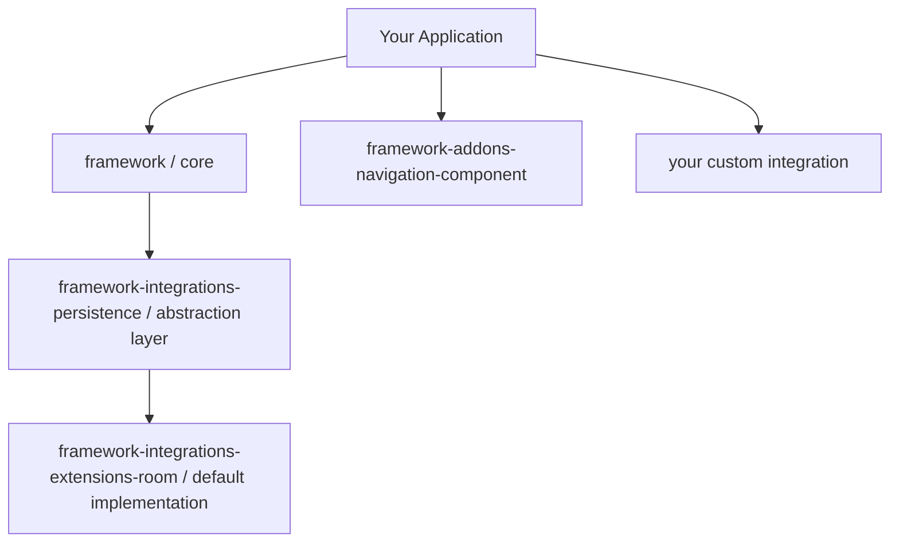

<div align="center">
  

  <h3>Prevent <code>TransactionTooLargeException</code> crashes. For good.</h3>
  <p>A modern Android framework for safely transporting large <code>Serializable</code> objects between components, without the crashes.</p>

  <br/>

  <a href="https://github.com/grarcht/Shuttle/blob/main/LICENSE.md"></a>
  <a href="https://search.maven.org/artifact/com.grarcht.shuttle/framework"></a>
  <a href="https://developer.android.com/studio/releases/platforms"></a>
  <a href="https://kotlinlang.org/"></a>

  <br/>

  <a href="https://androidweekly.net/issues/issue-594"></a>
  <a href="https://androidweekly.net/issues/issue-455"></a>

</div>

---

## Get To It Quick

- [Why Shuttle?](#-why-shuttle)
- [How It Works](#-how-it-works)
- [Quick Start](#-quick-start)
- [Usage](#-usage)
  - [Transport with Intents](#transport-with-intents)
  - [Transport with the Navigation Component](#transport-with-the-navigation-component)
  - [Pick Up Cargo at the Destination](#pick-up-cargo-at-the-destination)
  - [Cargo States (LCE Pattern)](#cargo-states-lce-pattern)
  - [Cleaning Up](#cleaning-up)
- [Architecture](#️-architecture)
  - [Context Diagram](#context-diagram)
  - [Module Overview](#module-overview)
  - [Module Dependency Diagram](#module-dependency-diagram)
- [Demo Apps](#-demo-apps)
- [Heads Up: Know the Tradeoffs](#️-heads-up-know-the-tradeoffs)
- [Contributing](#-contributing)
- [License](#-license)

---

## 🚨 Why Shuttle?

> 🗞️ **Featured in [Android Weekly #594](https://androidweekly.net/issues/issue-594) and [Android Weekly #455](https://androidweekly.net/issues/issue-455)**, validated by the Android community twice.

You've seen this before. Maybe last week:

```
android.os.TransactionTooLargeException: data parcel size X bytes
```

It didn't show up in dev. It didn't show up in QA. It showed up at 2am, in production, for real users. Your Play Store rating took the hit before anyone on the team even knew.

So you triaged it. Filed the ticket. Wrote the fix. Reviewed the PR. Ran QA again. Cut the hotfix. And then you added it to the code review checklist, hoping the next engineer would catch it before it happened again.

They won't. Not reliably. **You can't review your way out of a structural problem.**

Shuttle provides a modern, guarded way to pass large `Serializable` objects with `Intent` objects or save them in `Bundle` objects to avoid app crashes. The crash class is structurally prevented, not governed against.

Why keep spending more time and money on governance through code reviews? Why not embrace the problem by providing a solution for it?

**Shuttle reduces the high level of governance needed to catch `TransactionTooLargeException` inducing code by:**
1. storing the `Serializable` and passing an identifier for the `Serializable`
2. using a small-sized `Bundle` for binder transactions
3. avoiding app crashes from `TransactionTooLargeException`s
4. enabling retrieval of the stored `Serializable` at the destination

**Shuttle also excels by:**
1. providing a solution with maven artifacts
2. providing Solution Building Blocks (SBBs) for building on
3. saving time by avoiding DB and table setup, especially when creating many tables for the content of different types of objects

When envisioning, designing, and creating the architecture, quality attributes and best practices were kept in mind. These attributes include usability, readability, recognizability, reusability, maintainability, and more.

| Without Shuttle | With Shuttle |
|---|---|
| Large `Serializable` passed in `Intent`/`Bundle` | Object stored in a warehouse; only a small identifier is passed |
| Silent in dev, catastrophic in production | Binder transaction stays within safe size limits, everywhere |
| Time and money spent on crash investigation, fixes, QA, and hotfixes | Crash class is structurally impossible |
| Requires constant code review governance | Ship with confidence |
| Engineers manually manage object lifecycles | Automatic or on-demand cargo cleanup built in |
|  |  |

---

## ⚙️ How It Works

[](https://www.youtube.com/watch?v=4Nl9zlcbwU4)

The Shuttle framework takes its name from cargo transportation in the freight industry. Moving and storage companies experience scenarios where large moving trucks cannot transport cargo the entire way to the destination (warehouses, houses, et cetera). These scenarios might occur from road restrictions, trucks being overweight from large cargo, and more. As a result, companies use small Shuttle vans to transport smaller cargo groups on multiple trips to deliver the entire shipment.

After the delivery is complete, employees remove the cargo remnants from the shuttle vans and trucks. This clean-up task is one of the last steps for the job.

The Shuttle framework takes its roots in these scenarios:
- creating a smaller cargo bundle object to use in successfully delivering the data to the destination
- shuttling the corresponding large cargo to a warehouse and storing it for pickup
- linking the smaller cargo with the larger cargo by an identifier
- providing a single source of truth (Shuttle interface) to use for transporting cargo
- providing convenience functions to remove cargo (automatically or on-demand)

Shuttle applies this same logic to Android's binder transaction limit:

```
┌─────────────────────────────────────────────────────────────┐
│  Source Component                                           │
│  1. Large Serializable -> stored in Warehouse (Room/DB)     │
│  2. Small cargo ID     -> passed in Intent/Bundle           │
└──────────────────────────────┬──────────────────────────────┘
                               │ (tiny binder transaction)
┌──────────────────────────────▼──────────────────────────────┐
│  Destination Component                                      │
│  3. Cargo ID received -> retrieved from Warehouse           │
│  4. Large Serializable -> delivered via Kotlin Channel      │
│  5. Cleanup -> cargo removed from Warehouse automatically   │
└─────────────────────────────────────────────────────────────┘
```

---

## 🚀 Quick Start

### 1. Add Dependencies

**Kotlin DSL (`build.gradle.kts`):**
```kotlin
implementation("com.grarcht.shuttle:framework:3.0.3")
implementation("com.grarcht.shuttle:framework-integrations-persistence:3.0.3")
implementation("com.grarcht.shuttle:framework-integrations-extensions-room:3.0.3")
implementation("com.grarcht.shuttle:framework-addons-navigation-component:3.0.3") // Optional
```

**Version Catalog (`libs.versions.toml`):**
```toml
[versions]
shuttle = "3.0.3"

[libraries]
shuttle-framework = { group = "com.grarcht.shuttle", name = "framework", version.ref = "shuttle" }
shuttle-persistence = { group = "com.grarcht.shuttle", name = "framework-integrations-persistence", version.ref = "shuttle" }
shuttle-room = { group = "com.grarcht.shuttle", name = "framework-integrations-extensions-room", version.ref = "shuttle" }
shuttle-navigation = { group = "com.grarcht.shuttle", name = "framework-addons-navigation-component", version.ref = "shuttle" }
```

### 2. Ship Your First Cargo

```kotlin
// Source: transport a large Serializable via Intent
shuttle.intentCargoWith(context, DestinationActivity::class.java)
    .transport(cargoId, myLargeSerializable)
    .cleanShuttleOnReturnTo(SourceFragment::class.java, DestinationActivity::class.java, cargoId)
    .deliver(context)
```

```kotlin
// Destination: pick up the cargo
lifecycleScope.launch {
    getShuttleChannel()
        .consumeAsFlow()
        .collectLatest { result ->
            when (result) {
                is ShuttlePickupCargoResult.Success<*> -> render(result.data as MyModel)
                is ShuttlePickupCargoResult.Error<*>   -> showError()
                ShuttlePickupCargoResult.Loading        -> showLoading()
            }
        }
}
```

That's it. No custom DB setup. No table management. No crash.

---

## 📦 Usage

The recommended entry point is the `Shuttle` interface with `CargoShuttle` as the implementation. It's a single source of truth for all cargo transport operations.

### Transport with Intents

**Source component:**
```kotlin
val cargoId = ImageMessageType.ImageData.value

shuttle.intentCargoWith(context, MVCSecondControllerActivity::class.java)
    .transport(cargoId, imageModel)
    .cleanShuttleOnReturnTo(
        MVCFirstControllerFragment::class.java,
        MVCSecondControllerActivity::class.java,
        cargoId
    )
    .deliver(context)
```

> ℹ️ `cleanShuttleOnReturnTo` is important. It ensures cargo is purged from the Warehouse when it's no longer needed.

### Transport with the Navigation Component

**Source fragment:**
```kotlin
val cargoId = ImageMessageType.ImageData.value

navController.navigateWithShuttle(shuttle, R.id.MVVMNavSecondViewActivity)
    ?.logTag(LOG_TAG)
    ?.transport(cargoId, imageModel as Serializable)
    ?.cleanShuttleOnReturnTo(
        MVVMNavFirstViewFragment::class.java,
        MVVMNavSecondViewActivity::class.java,
        cargoId
    )
    ?.deliver()
```

### Pick Up Cargo at the Destination

**In a Fragment/Activity:**
```kotlin
lifecycleScope.launch {
    getShuttleChannel()
        .consumeAsFlow()
        .collectLatest { result ->
            when (result) {
                ShuttlePickupCargoResult.Loading        -> initLoadingView(view)
                is ShuttlePickupCargoResult.Success<*>  -> { showSuccessView(view, result.data as ImageModel); cancel() }
                is ShuttlePickupCargoResult.Error<*>    -> { showErrorView(view); cancel() }
            }
        }
}
```

**In a ViewModel:**
```kotlin
viewModelScope.launch {
    shuttle.pickupCargo<Serializable>(cargoId = cargoId)
        .consumeAsFlow()
        .collectLatest { result ->
            pickupCargoMutableStateFlow.value = result
            when (result) {
                is ShuttlePickupCargoResult.Success<*>,
                is ShuttlePickupCargoResult.Error<*> -> cancel()
                else -> { /* await */ }
            }
        }
}
```

### Cargo States (LCE Pattern)

Shuttle returns sealed class results that promote the **Loading-Content-Error (LCE)** pattern, giving consumers full control over UI state, analytics, and error handling.

| Operation | Return Type | States |
|---|---|---|
| Store cargo | `Channel<ShuttleStoreCargoResult>` | `Storing`, `Success`, `Error` |
| Pick up cargo | `Channel<ShuttlePickupCargoResult>` | `Loading`, `Success`, `Error` |
| Remove cargo | `Channel<ShuttleRemoveCargoResult>` | `Removing`, `Success`, `Error` |

### Cleaning Up

Cargo is automatically removed when using `cleanShuttleOnReturnTo`. For manual control:

```kotlin
// Remove a specific cargo item
shuttle.removeCargoBy(cargoId)

// Remove all cargo
shuttle.removeAllCargo()
```

---

## 🏗️ Architecture

Shuttle is a layered **Solution Building Block (SBB)** framework. Each layer has a well-defined responsibility and no layer forces technology choices on consumers.

### Module Overview

| Module | Role | Required? |
|---|---|---|
| `framework` | Core interfaces, transport logic, sealed result types | ✅ Yes |
| `framework-integrations-persistence` | Persistence abstraction/interfaces | ✅ Yes |
| `framework-integrations-extensions-room` | Room implementation of persistence interfaces | ⚡ Default (swappable) |
| `framework-addons-navigation-component` | Navigation Component integration | ➕ Optional |

### Context Diagram


### Module Dependency Diagram



**Why this layering matters:** The persistence abstraction means you can swap Room for any other storage implementation without touching the framework or your application code. Bring your own persistence layer by implementing the integration interfaces.

Shuttle avoids bundling large reactive libraries. Asynchronous communication runs on **Kotlin Coroutines and Channels** only, which keeps the transitive dependency footprint lean.

---

## 🎬 Demo Apps

The demo apps show both the crash scenario and the Shuttle solution side-by-side, using image data transport. Image data is one of the most common real-world contributors to `TransactionTooLargeException`.

**MVVM:** Activities/Fragments as View, `ViewModel` as state owner and liaison, Kotlin Channels for async notification.

### Flow 1: Navigate with Shuttle ✅
Tap **"Navigate using Shuttle"** -> image loads successfully via warehouse pickup.

| Main Menu | Loading | Loaded |
|---|---|---|
|  |  |  |

### Flow 2: Navigate Normally ❌
Tap **"Navigate Normally"** -> app crashes with `TransactionTooLargeException`.

| Main Menu | After Crash |
|---|---|
|  |  |

> ℹ️ For image loading in production, use [Glide](https://github.com/bumptech/glide) or [Coil](https://github.com/coil-kt/coil). The demo uses raw image data intentionally to trigger the crash condition.

---

## ⚠️ Heads Up: Know the Tradeoffs

**Other `Parcelable` objects in the same `Intent` can still crash your app.** Shuttle protects the `Serializable` payload. It doesn't protect unrelated Parcelable data you're also passing.

**`Serializable` is slower than `Parcelable`.** Parcelable is optimized for IPC and faster to load, but it's unsafe for disk storage. Google recommends serialization for persistence, which is why Shuttle uses it. The LCE state pattern (loading state) gives your UI the hook it needs to handle the slightly longer load time gracefully.

These are documented tradeoffs, not bugs. Architecture is always about weighing options. This one is worth it.

---

## 🤝 Contributing

Pull requests are welcome. Check the [Contributing Guide](https://github.com/grarcht/Shuttle/blob/main/CONTRIBUTING.md) and [Code of Conduct](https://github.com/grarcht/Shuttle/blob/main/CODE_OF_CONDUCT.md) before opening one.

1. Fork the repo
2. Create a feature branch: `git checkout -b feature/my-feature`
3. Commit your changes: `git commit -m 'Add: my feature'`
4. Push the branch: `git push origin feature/my-feature`
5. Open a Pull Request targeting `develop`

For bugs and feature requests, [open an issue](https://github.com/grarcht/Shuttle/issues).

---

## 📄 License

MIT. See [LICENSE.md](https://github.com/grarcht/Shuttle/blob/main/LICENSE.md) for full terms.

Copyright © 2023 Craft & Graft LLC · GRARCHT ™ 2021

---

<div align="center">
  <sub>Built with care by <a href="https://github.com/grarcht">GRARCHT</a> · <a href="https://androidweekly.net/issues/issue-594">Android Weekly #594</a> · <a href="https://androidweekly.net/issues/issue-455">Android Weekly #455</a></sub>
</div>
